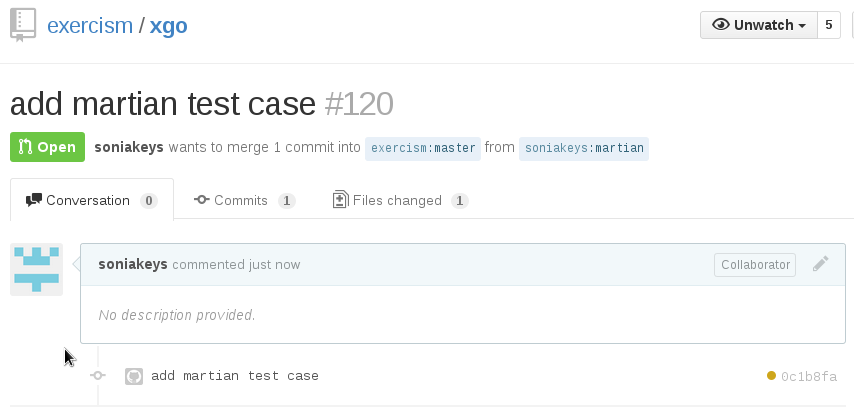

# Exercism Go Track

[](https://travis-ci.org/exercism/go)

Exercism exercises in Go

## Issues

We welcome issues filed at https://github.com/exercism/go/issues for problems of any size.  Feel free to report
typographical errors or poor wording.  We are most interested in improving the quality of the test suites.
You can greatly help us improve the quality of the exercises by filing reports of invalid solutions that
pass tests or of valid solutions that fail tests.

## Development setup

Beyond filing issues, if you would like to contribute directly to the Go code in the Exercism Go track, you should follow some
standard Go development practices.  You should have a [recent version of Go](http://golang.org/doc/install)
installed, ideally either the current release, the previous release, or tip.

You will need a github account and you will need to fork exercism/go to your account.
See [GitHub Help](https://help.github.com/articles/fork-a-repo/) if you are unfamiliar with the process.
Clone your fork with the command: `git clone https://github.com/<you>/go`.
Test your clone by cding to the go directory and typing
`bin/test-without-stubs`. You should see tests pass for all exercises.

Note that unlike most other Go code, it is not necessary to clone this to your GOPATH.
This is because this repo only imports from the standard library and isn't expected to be imported by other packages.

Your Go code should be formatted using the [gofmt](https://golang.org/cmd/gofmt/) tool. For the other file types in the repository you may want to copy the setup used in the [.editorconfig](http://editorconfig.org/) file from [the exercism.io repository](https://github.com/exercism/exercism.io/blob/master/.editorconfig).

There is a [misspelling tool](https://github.com/client9/misspell). You can install and occasionally run it to
find low hanging typo problems. [#570](https://github.com/exercism/go/pull/570) It's not added into CI since it could give false positives.

## Contributing Guide

Please be familiar with the [contributing guide](https://github.com/exercism/docs/tree/master/contributing-to-language-tracks)
in the docs repository.  This describes some great ways to get involved.
In particular, please read the [Pull Request Guidelines](https://github.com/exercism/docs/blob/master/contributing/pull-request-guidelines.md) before opening a pull request.

## Exercism Go style

Let's walk through the an imaginary `exercise-slug` exercise to see what is included in an exercise
implementation. In any exercise you may see a number of files present:

```sh
~/exercism/go/exercise-slug
$ tree -a
.
├── cases_test.go
├── example.go
├── exercise_slug.go
├── exercise_slug_test.go
├── .meta
│   └── description.md
│   └── gen.go
│   └── hints.md
│   └── metadata.yml
└── README.md
```

This list of files *can vary* across exercises. Not all exercise
utilize all of the available files, but they are available for use
should an exercise need to adjust itself against [the global problem-specification repository](https://github.com/exercism/problem-specifications/tree/master/exercises). This
repository helps collect common information for all exercises across
all tracks. However, should local track-specific modifications or
enhancements be made with respect to the global problem specifications
they may be performed by the presence of specifically named files in
an exercises `.meta/` directory.

So let's quickly run through each potential file and briefly describe
what and why it is.

* **cases_test.go** - This file contains [generated test cases](#generating-test-cases),
  and will only be present in some exercises. These will be 
  automatically generated by a *.meta/gen.go* file and should
  represent test data sourced from the problem-specifications repository.

* **example.go** - This is an [example solution](#example-solutions) for
  the exercise. It is used in integration testing and to provide a
  reference example of a solution to the exercise. This file is ignored
  by the `exercism fetch` command. See [ignored files](#ignored-files)
  for details on which files are ignored.

* **exercise_slug.go** - This is a *stub file*, and will only be
  present in some exercises as a way to give users a useful starting
  point.

* **exercise_slug_test.go** - This is the main test file for the
  exercise.

* **.meta/** - The `.meta/` directory contains files that are not
  to be included when a user fetches an exercise: test case generators
  and README inclusion files. These files are for tooling and will not
  be present for users of the exercise. (Again, see [ignored files](#ignored-files).)

* **.meta/description.md** - This file, along with some others (below)
  in the `.meta` directory are used to [generate exercise specific elements](https://github.com/exercism/docs/blob/master/language-tracks/exercises/anatomy/readmes.md)
  of the exercise's README.md file. Any content in this file will
  completely override the description.md of the exercise from the
  [problem-specifications repository](https://github.com/exercism/problem-specifications/tree/master/exercises).

* **.meta/gen.go** - This file, unique within the `.meta` directory,
  generates the *cases_test.go* file, and will only be present in some
  exercises should they have problem-specification test data and this
  generator is present to to utilize it. See [generating test cases](#generating-test-cases) 
  for more information.

* **.meta/hints.md** - This is another README related file, it should
  used for the inclusion of any track specific information beyond what
  would be present in a generic exercise's problem-specification
  description.

* **.meta/metadata.yml** - Like the `meta/*.md` files, this will
  override the exercise metadata from the problem-specifications
  repository. For now **the metadata file must be present** for the
  `description.md` file to be used: see exercism/configlet#65.

In some exercises there can be extra files, for instance the
[series](exercises/series/) exercise contains extra test files.

### Ignored files

When a user fetches an exercise, they do not need to get all the files within an
exercise directory. For instance; the *example.go* files that contain an
example solution, or the *gen.go* files used to generate an exercise's test
cases. Therefore there are certain files and directories that are ignored when
an exercise is fetched. These are:

* The *.meta* directory and anything within it.
* Any file that matches the `ignore_pattern` defined in the [config.json file](/config.json).
    This currently matches any filename that contains the word `example`, **unless**
    it is followed by the word `test`, with any number of characters inbetween.


### Example solutions

*example.go* is a reference solution. It is a valid solution that [Travis](https://travis-ci.org/exercism/go),
the CI (continuous integration) service, can run tests against. Solvers generally
will not see it though. Files with *"example"* in the file name are skipped by
the `exercism fetch` command. Because of this, there is less need for this code
to be a model of style, expression and readability, or to use the best algorithm.
Examples can be plain, simple, concise, even naïve, as long as they are correct.
The test file though, is fetched for the solver and deserves attention for consistency
and appearance.

### Tests

The `leap` exercise makes use of data-driven tests. Test cases are defined as
data, then a test function iterates over the data. In this exercise, as they are
generated, the test cases are defined in the *cases_test.go* file. The test function
that iterates over this data is defined in the *leap_test.go* file.

Identifiers within the test function appear in actual-expected order as described
at [Useful Test Failures](https://github.com/golang/go/wiki/CodeReviewComments#useful-test-failures).
Here the identifier `observed` is used instead of actual. That's fine. More
common are words `got` and `want`. They are clear and short. Note [Useful Test
Failures](https://github.com/golang/go/wiki/CodeReviewComments#useful-test-failures)
is part of [Code Review Comments](https://github.com/golang/go/wiki/CodeReviewComments).
Really we like most of the advice on that page.

In Go we generally have all tests enabled and do not ask the solver to edit the
test program, to enable progressive tests for example. `t.Fatalf()`, as seen
in the *leap_test.go* file, will stop tests at the first failure encountered,
so the solver is not faced with too many failures all at once.

### Benchmarks

In most test files there will also be benchmark tests, as can be seen at the end
of the *leap_test.go* file. In Go, benchmarking is a first-class citizen of the
testing package. We throw in benchmarks because they're interesting, and because
it is idiomatic in Go to think about performance. There is no critical use for
these though. Usually they will just bench the combined time to run over all
the test data rather than attempt precise timings on single function calls. They
are useful if they let the solver try a change and see a performance effect.

### Testable examples

Some exercises can contain [Example tests](https://blog.golang.org/examples)
that document the exercise API. These examples are run alongside the standard
exercise tests and will verify that the exercise API is working as expected.
They are not required by all exercises and are not intended to replace the
data-driven tests. They are most useful for providing examples of how an
exercise's API is used. Have a look at the example tests in the [clock exercise](https://github.com/exercism/go/blob/master/exercises/clock/example_clock_test.go)
to see them in action.

### Stub files

Stub files, such as *leap.go*, are a starting point for solutions. Not all exercises
need to do this; this is most helpful in the early exercises for newcomers to Go.
By convention, the stub file for an exercise with slug `exercise-slug`
must be named `exercise_slug.go`. This is because CI needs to delete stub files
to avoid conflicting definitions.

The track exercises may or may not provide stub files. The first few exercises
provide stubs as a helpful starting point. The initial exercise users will encounter
without a stub is [twelve-days](exercises/twelve-days/). At this point users will
have some experience in creating solutions for the exercises and can begin to
create their own solutions from scratch. Some of the later exercises may have stub
files if the author thinks there may be implementation confusion, a particularly
difficult concept, or boilerplate code needed.

### Problem Versioning

Each problem defines a `const targetTestVersion` in the test file, and validates
that the solution has defined a matching value `testVersion`. Any Go track developer
that changes the test file or test data must increment `targetTestVersion`.

The benefit of all this is that reviewers can see which test version a posted
solution was written for and be spared confusion over why an old posted solution
might not pass current tests.

Notice that neither the `testVersion` nor the `targetTestVersion` is exported.
This is so that golint will not complain about a missing comment. In general,
adding tests for unexported names is considered an anti-pattern, but in this
case the trade-off seems acceptable.

### Errors

We like errors in Go. It's not idiomatic Go to ignore invalid data or have undefined
behavior. Sometimes our Go tests require an error return where other language
tracks don't.

## Generating test cases

Some problems that are implemented in multiple tracks use the same inputs and
outputs to define the test suites. Where the [x-common](https://github.com/exercism/x-common)
repository contains a *canonical-data.json* file with these inputs and outputs,
we can generate the test cases programmatically.

See the *gen.go* file in the `leap` exercise for an example of how this
can be done.

Test case generators are named *gen.go* and are kept in a special *.meta*
directory within each exercise that makes use of a test cases generator. This
*.meta* directory will be ignored when a user fetches an exercise.

Whenever the shared JSON data changes, the test cases will need to be regenerated.
The generator will first look for a local copy of the **x-common** repository.
If there isn't one it will attempt to get the relevant json data for the
exercise from the **x-common** repository on GitHub.

To use a local copy of the **x-common** repository, make sure that it has been
cloned into the same parent-directory as the **go** repository.

```sh
$ tree -L 1 .
.
├── x-common
└── go
```

To regenerate the test cases, navigate into the **go** directory and run
`go run exercises/<exercise>/.meta/gen.go`. You should see that the
`<exercise>/cases_test.go` file has changed. Commit the change.

## Pull requests

Pull requests are welcome.  You forked, cloned, coded and tested and you have something good?  Awesome!  Use git
to add, commit, and push to your repository.  Checkout your repository on the web now.  You should see your commit
and the invitation to submit a pull request!


Click on that big green button.  You have a chance to add more explanation to your pull request here, then send
it.  Looking at the exercism/go repository now instead of your own, you see this.



That inconspicuous orange dot is important!  Hover over it (no, not on this image, on a real page) and you can see
it's indicating that a Travis CI build is in progress.  After a few minutes (usually) that dot will turn green
indicating that tests passed.  If there's a problem, it comes up red:


This means you've still got work to do.  Click on "details" to go to the Travis site and look over the build log
for clues.  Usually error messages will be helpful and you can correct the problem.

## Direction

Directions are unlimited.  This code is fresh and evolving.  Explore the existing code and you will see some new
directions being tried.  Your fresh ideas and contributions are welcome.  :sparkles:


### Go icon
The Go logo was designed by Renée French, and has been released under the Creative Commons 3.0 Attributions license.
